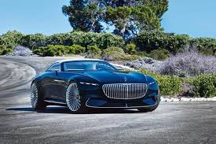
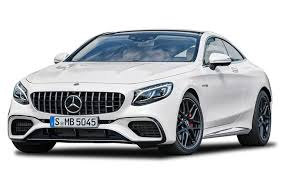

<!DOCTYPE html>
<html lang="en">
<head>
  <title>World Of Cars</title>
  <meta charset="utf-8">
  <meta name="viewport" content="width=device-width, initial-scale=1">
  <link rel="stylesheet" href="https://maxcdn.bootstrapcdn.com/bootstrap/4.1.3/css/bootstrap.min.css">
  
  
  
  
</head>
<body>

  <h1>World Of Cars</h1>
  
Know everything about cars!
 

<nav class="navbar navbar-expand-sm bg-dark navbar-dark">
  <a class="navbar-brand" href="#">Navbar</a>
  <button class="navbar-toggler" type="button" data-toggle="collapse" data-target="#collapsibleNavbar">
    
  </button>
  

    <ul class="navbar-nav">
      <li class="nav-item">
        <a class="nav-link active" href="Index.html">Home</a>
      </li>
      <li class="nav-item">
        <a class="nav-link" href="Gallery.html">Gallery</a>
      </li> 
    </ul>
  
  
</nav>

  

    

      <h2>My Favourite Car</h2>
      <h5>Photo of it:</h5>
       
      

Maybach motorenbau is a defunct German car manufacturer that today exists  as a sub-brand of Mercedes-Benz. The company was founded  in 1909 by Wilhelm Maybach and his son, originally a  subsidiary of Luftschiffbau Zeppelin GmbH and was itself  known as Luftfahrzeug-Motorenbau GmbH until 1912.

      <h3>Watch some memes</h3>
      
      <ul class="nav nav-pills flex-column">
        <li class="nav-item">
          <a class="nav-link" href="https://triumph-smithsonian-penalty-desk.trycloudflare.com">SUV</a>
       </li>
       
      </ul>
      
      

    

    

      <h2>New Mercedez AMG</h2>
      <h5>High Performance Brand</h5>
      
      
It is known for its luxurious interior and outstanding looks.

      
It is founded by Hans Werner Aufrecht and Erhard Melcher
     
  <h2>One of the best brands..</h2>
      <h5>Is BUGATTI</h5>
      Automobiles Ettore Bugatti was a French car manufacturer of  high-performance automobiles, founded in 1909 in the then  German city of Molsheim, Alsace by Italian-born Ettore Bugatti. 

       
      
    

  

  
Copyright approved, 2018

</body>
</html>
